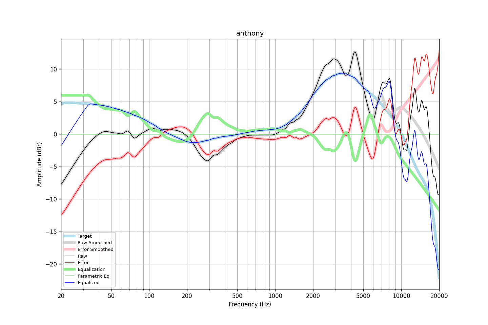

# anthony
See [usage instructions](https://github.com/jaakkopasanen/AutoEq#usage) for more options and info.

### Parametric EQs
In case of using parametric equalizer, apply preamp of **-0.2dB** and build filters manually
with these parameters. 

| Type   | Fc   | Q   | Gain   |
|:-------|:-----|:----|:-------|

### Graphs
