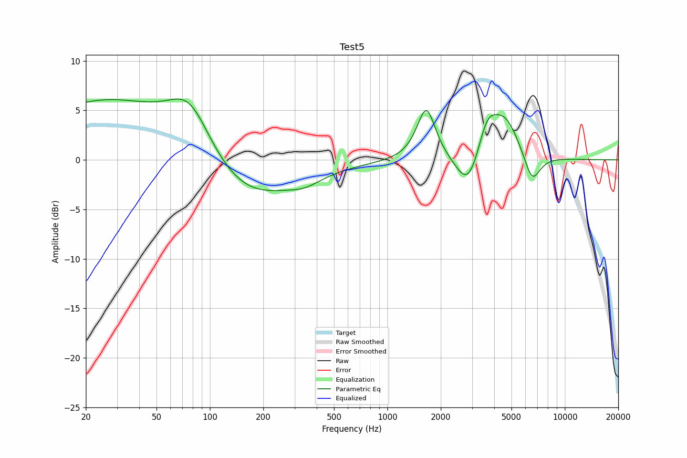

# Test5
See [usage instructions](https://github.com/jaakkopasanen/AutoEq#usage) for more options and info.

### Parametric EQs
In case of using parametric equalizer, apply preamp of **-6.3dB** and build filters manually
with these parameters. 

| Type    | Fc      |    Q | Gain    |
|:--------|:--------|:-----|:--------|
| Peaking | 26 Hz   | 0.34 | 6.0 dB  |
| Peaking | 77 Hz   | 1.12 | 5.5 dB  |
| Peaking | 149 Hz  | 0.5  | -4.9 dB |
| Peaking | 343 Hz  | 1.61 | -0.8 dB |
| Peaking | 1656 Hz | 2.7  | 5.4 dB  |
| Peaking | 2821 Hz | 2.49 | -1.6 dB |
| Peaking | 2952 Hz | 1.74 | -2.7 dB |
| Peaking | 3641 Hz | 2.4  | 3.9 dB  |
| Peaking | 4618 Hz | 1.75 | 3.9 dB  |
| Peaking | 6538 Hz | 3.04 | -3.1 dB |

### Graphs
